# What is Linux?

**Linux** is the best-known and most-used open source operating system. Popular distributions include **Ubuntu**, **Fedora**, **CentOS**, **openSUSE**, and **Red Hat**.

Most Linux distributions use **graphical user interface (GUI)**, making them beginner-friendly. However, it is recommended to use the **command line interface (CLI)** because it's quicker and offers more control.

## Basic Commands in Linux

**Linux commands** are a type of Unix command or shell procedure. They run on the **command line interface (CLI)** and interact with your system via texts and processes.

Linux commands are used to perform a variety of tasks, including displaying information about files and directories.

### `sudo` command

**sudo** which is short for **superuser do** is a command that lets you perform tasks that require administrative permissions.

For example **sudo apt upgrade** is used to install and download all the latest package information available for the packages currently installed on the system.

### `pwd` command

**pwd** stands for **print working directory**

It writes to standard output the full path name of your current directory.

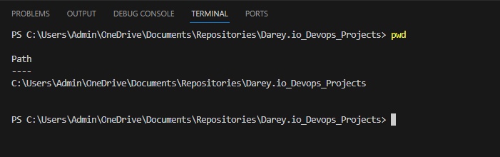

### `cd` command

**cd** stands for **change directory** and is used to change the current working directory.

**cd ..** moves one directory up.

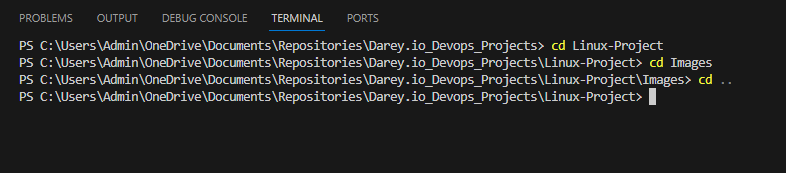

### `ls` command

**ls** lists directory contents of files and directories. 

**ls -S** sorts files and directories by their sizes, listing the largest ones first.

### `cat` command

**cat** is short for **Concatenate** and is used to list, combine and write file content to the standard output.

### `cp` command

**cp** means **copy** and is used to copy a file to a specified location.

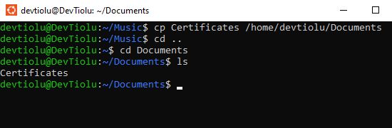

To copy more than one file, enter the file names followed by the destination directory.

To copy an entire directory, pass the -R flag before typing the source directory followed by the destination directory.

### `mv` command

**mv** can be used to **move** a file or directory to a new location. It can also be used to **rename** a file or directory.

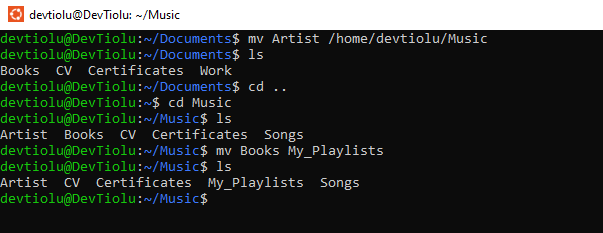

### `mkdir` command

**mkdir** stands for **make directory** and is used to create a new directory.

### `rmdir` command

**rmdir** stands for **remove directory** and is used to delete an empty directory.

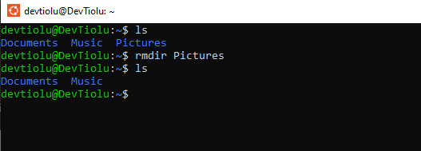

### `rm` command

**rm** stands for **remove** is used to delete files within a directory.

### `touch` command

**touch** is used to create a new empty file.

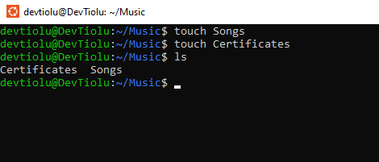

### `locate` command

**locate** is used to find a file in the database.

### `find` command

**find** is used to search for files within a specific directory and perform subsequent operations.

### `grep` command

**grep** stands for **global regular expression print** and lets you find a word by searching through all the texts in a specific file.

### `df` command

The **df** command is used to report the system's disk space usage shown in percentage and kilobyte (KB). 

**df -m**  displays the file system usage in MBs while **df -k** displays it in KBs.

### `du` command

**du** is used to check how much space a file or directory takes up.

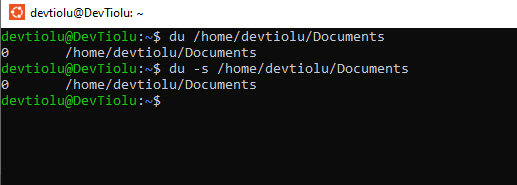

### `head` command

**head** displays the first ten lines of a text. 

### `tail` command

**tail** displays the last ten lines of a text. It is used to check if a file has new data or to view error messages.

### `diff` command

**diff** stands for **difference** and it compares the contents of two files. It then returns the parts that do not match. 

diff [option] file1 file2

### `tar` command

**tar** archives multiple files into a TAR file.

tar [options] [archive_file] [file or directory to be archived]

### `chmod` command

**chmod** is used to modify file permissions to control who can read, write, or execute a file. 

### `chown` command

**chown** is used to change ownership of a file, directory or symbolic limk to a specific username.

### `jobs` command

**jobs** displays all running processes and their statuses.

### `kill` command

**kill** is used to terminate an unresponsive program manually.

### `ping` command

**ping** is used to check whether a network or server is reachable.

It is also used to troubleshoot various connectivity issues.

### `wget` command

**wget** lets you download files from the internet without hindering othr running processes.

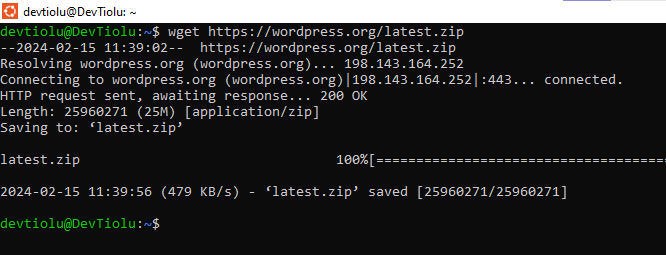

### `uname` command

**uname** prints detailed information about your linux system and hardware.

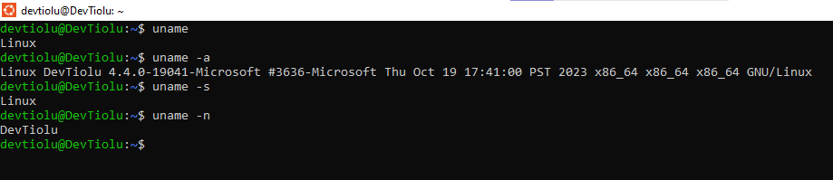

### `top` command

**top** displays all the running processes and a dynamic real-time view of the current system.

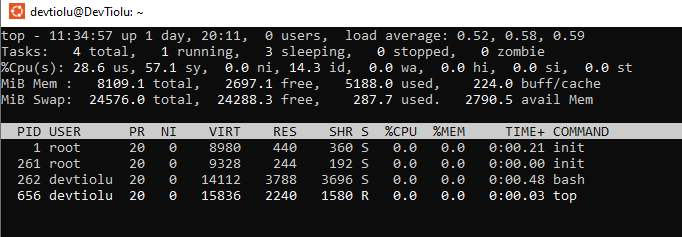

### `history` command

**history** lists up to 500 previously executed commands, allowing you to reuse them without re-entering. 

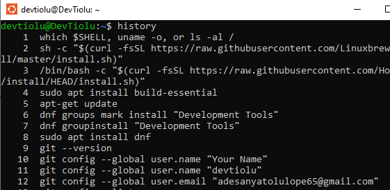

### `man` command

**man** provides a user manual of any commands and utilities you can run in the Terminal including the name, descrption, and options

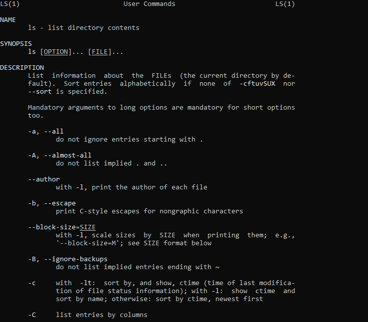

### `echo` command

**echo** displays a line of text or string using the standard output.

### `zip, unzip` commands

**zip** is used to compress your files into a zip file .

It is also useful for archiving files and directories hereby reducing disk usage.

**unzip** is used to extract zipped files from an archive.

### `hostname` command

**hostname** returns the system's hostname.

### `useradd, userdel` commands

**useradd** is used to create a new user account.

**userdel** is used to delete a user account.

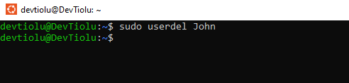

### `apt get` command

**apt_get** is a command line tool for handling **Advanced Package Tool (APT)** libraries in Linux.

It lets you retrieve information from authenticated sources to manage, update, remove, and install software and its dependencies.

### `nano, vi, jed` commands

**Linux** lets users edit and manage files via a text editor, such as **nano**, **vi**, and **jed**.

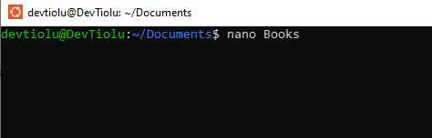

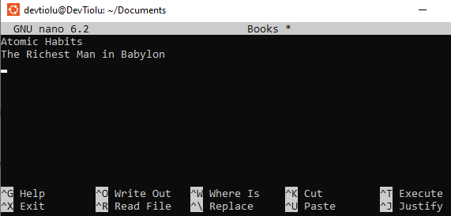

### `alias, unalias` commands

**alias** allows you to create a shortcut with the same functionality as a command, file name or text.

**unalias** deletes an existing alias.

### `su` command

**su** stands for **switch user** and allows you run a program as a different user.

### `htop` command

**htop** monitors system resources and server processes in real time.

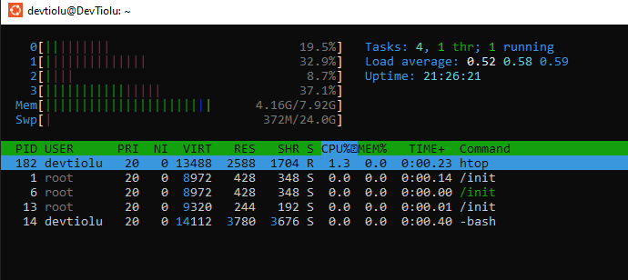

### `ps`command

**ps** stands for **process status** and lists all currently running processes.

