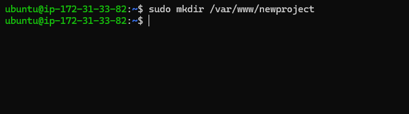

# LAMP STACK IMPLEMENTATION
- **Linux** 
- **Apache** 
- **MySQL** 
- **PHP**

## Installing Apache Web Server

- Update a list of packages in **Ubuntu’s** package manager, **apt**. 

`sudo apt update`


- Install **Apache** using the package manager.

`sudo apt install apache2`


- Verify that **Apache** is running in your OS using the following command;

`sudo systemctl status apache2`


- Check if the server can be accessed locally using either of these; 

 `curl http://localhost:80`  

`curl http://127.0.0.1:80`


- Check if the Apache HTTP server can respond to requests from the internet.

`http://<Public-IP-Address>:80`

## Installing MySQL

- Use **apt** to install **MySQL**.

`sudo apt install mysql-server`


- Log into MySQL console.

`sudo mysql`


- Set a password for the root user.

`ALTER USER 'root'@'localhost' IDENTIFIED WITH mysql_native_password BY 'PassWord.1';`


- Run SQL security script.

`sudo mysql_secure_installation`


- To log into MySQL and exit it, use the following commands;

`sudo mysql -p`

`mysql> exit`


## Installing PHP

In addition to the **php** package, you’ll need **php-mysql**, a PHP module that allows PHP to communicate with MySQL-based databases. You’ll also need **libapache2-mod-php** to enable Apache to handle PHP files.

- To install the 3 packages, run `sudo apt install php libapache2-mod-php php-mysql`


- To confirm php version, run `php -v`


## Creating a Virtual Host for your website using Apache

- Create the directory `newproject` using `mkdir`

`sudo mkdir /var/www/newproject`



- Assign ownership of the directory with your current system user.

`sudo chown -R $USER:$USER /var/www/newproject`


- Create and open a new configuration file in Apache's `sites-available` directory using **vi**

`sudo vi /etc/apache2/sites-available/newproject.conf`


- Hit i on the keyboard to enter editing mode and paste the following text;

```
<VirtualHost *:80>
    ServerName newproject
    ServerAlias www.newproject 
    ServerAdmin webmaster@localhost
    DocumentRoot /var/www/newproject
    ErrorLog ${APACHE_LOG_DIR}/error.log
    CustomLog ${APACHE_LOG_DIR}/access.log combined
</VirtualHost>
```


- You can use **ls** to show the new file in `sites-available`

`sudo ls /etc/apache2/sites-available`


- Use a2ensite command to enable the new virtual host.

`sudo a2ensite newproject`

- To disable Apache’s default website use a2dissite command

`sudo a2dissite 000-default`

- To make sure your configuration file doesn’t contain syntax errors, run:

`sudo apache2ctl configtest`

- Reload Apache so the changes take effect.

`sudo systemctl reload apache2`


- Create an index.html file to test that the virtual host works as expected.

```
sudo echo 'Hello LAMP from hostname' $(curl -s http://169.254.169.254/latest/meta-data/public-hostname) 'with public IP' $(curl -s http://169.254.169.254/latest/meta-data/public-ipv4) > /var/www/newproject/index.html
```

- Go to your browser, and try to open wenbsite url using the IP address.

`http://<Public-IP-Address>:80`

## Enable PHP on the website
With the default **DirectoryIndex** settings on Apache, a file named **index.html** will always take precedence over an **index.php file**.

To change this behavior, you need to edit the **/etc/apache2/mods-enabled/dir.conf** file and change the order in which the **index.php** file is listed within the **DirectoryIndex** directive.

`sudo vim /etc/apache2/mods-enabled/dir.conf`


```
<IfModule mod_dir.c>
        #Change this:
        #DirectoryIndex index.html index.cgi index.pl index.php index.xhtml index.htm
        #To this:
        DirectoryIndex index.php index.html index.cgi index.pl index.xhtml index.htm
</IfModule>
```

- After saving and closing the file, reload apache so the changes take effect.

`sudo systemctl reload apache2`


- Create a **PHP script** to test that **PHP** is correctly installed and configured on the server. Create a new file called **index.php**.

`vim /var/www/newproject/index.php`


- Add the following text;

```
<?php
phpinfo();
```

- Save and close the file and refresh the page.

