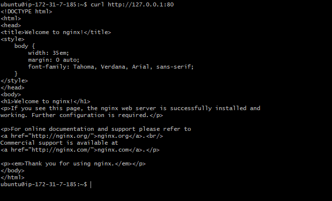

# LEMP STACK IMPLEMENTATION
- **Linux** 
- **Nginx** 
- **MySQL** 
- **PHP**

## Prerequisites

- Create an EC2 instance in **AWS**.

- Install [Git](https://git-scm.com/downloads) and launch **Git Bash**.

- Connect to your EC2 Instance by running the following command;

`ssh -i <Your-private-key.pem> ubuntu@<EC2-Public-IP-address>`


## Installing the Nginx Web Server

- Use **apt** package manager to install **Nginx**.

`sudo apt update`


`sudo apt install nginx`


- To verify that Nginx was successfully installed and is running as a service in Ubuntu, run;

`sudo systemctl status nginx`


If it is green and running, you did everything correctly.

- Add a rule to the **EC2** configuration to allow inbound connection through port 80. This is neccessary because **TCP port 80** is the default port that web browsers use to access web pages on the internet.

- To access the web server locally, run;

```
curl http://localhost:80
or
curl http://127.0.0.1:80
```



- Access the following url from any web browser.

`http://<Public-IP-Address>:80`

- The public IP address can be gotten on the AWS console or by using the following command `curl -s http://169.254.169.254/latest/meta-data/public-ipv4`


## Installing MySQL

- Use **apt** to install **MySQL**.

`sudo apt install mysql-server`


- Log into MySQL console and set a password for the root user.

```
sudo mysql

ALTER USER 'root'@'localhost' IDENTIFIED WITH mysql_native_password BY 'PassWord.1';
```


- Run SQL security script.

`sudo mysql_secure_installation`


- To log into MySQL and exit it, use the following commands;

```
sudo mysql -p
mysql> exit
```


## Installing PHP

While **Apache** embeds the PHP interpreter in each request, **Nginx** requires an external program to handle PHP processing and act as a bridge between the PHP interpreter itself and the web server.  

`sudo apt install php-fpm php-mysql`

When prompted, type **Y** and press **ENTER** to confirm installation.


## Configuring Nginx to use PHP Processor

When using the Nginx web server, we can create server blocks (similar to virtual hosts in Apache) to encapsulate configuration details and host more than one domain on a single server.

- Create the root web directory for your domain.

`sudo mkdir /var/www/projectLEMP`

- Assign ownership of the directory with the $USER environment variable, which will reference your current system user.

`sudo chown -R $USER:$USER /var/www/projectLEMP`

- Create a new configuration file in Nginx’s sites-available directory.

`sudo nano /etc/nginx/sites-available/projectLEMP`


- Paste the following code block in the new file.
```
#/etc/nginx/sites-available/projectLEMP

server {
    listen 80;
    server_name projectLEMP www.projectLEMP;
    root /var/www/projectLEMP;

    index index.html index.htm index.php;

    location / {
        try_files $uri $uri/ =404;
    }

    location ~ \.php$ {
        include snippets/fastcgi-php.conf;
        fastcgi_pass unix:/var/run/php/php8.1-fpm.sock;
     }

    location ~ /\.ht {
        deny all;
    }

}

```
Save and close the file by typing `CTRL+X`, then **y**, then **ENTER**.

- Activate your configuration by linking to the config file from Nginx’s sites-enabled directory.

`sudo ln -s /etc/nginx/sites-available/projectLEMP /etc/nginx/sites-enabled/`

- Test for syntax errors by typing `sudo nginx -t`


- Disable default Nginx host that is currently configured to listen on port 80.

`sudo unlink /etc/nginx/sites-enabled/default`

- Reload Nginx to apply the changes.

`sudo systemctl reload nginx`

- Create an index.html file to test that the new server block works as expected.

```
sudo echo 'Hello LEMP from hostname' $(curl -s http://169.254.169.254/latest/meta-data/public-hostname) 'with public IP' $(curl -s http://169.254.169.254/latest/meta-data/public-ipv4) > /var/www/projectLEMP/index.html
```


- Go to your browser and try to open the website URL using IP address.

`http://<Public-IP-Address>:80`


Your LEMP stack is now fully configured.

## Testing PHP with Nginx

- Create a test PHP file, **info.php** in your document root.

`nano /var/www/projectLEMP/info.php`


- Paste the following lines into the new file.
```
<?php
phpinfo();
```


- You can access this page in your web browser by visiting the public IP address you set followed by `info.php`.

`http://`server_domain_or_IP`/info.php`


## Retriving Data from MySQL Database with PHP 

You will create a **test database (DB)** with simple **"To do list"** and configure access to it, so the Nginx website would be able to query data from the **DB** and display it.

- Connect to the MySQL console using the root account, `sudo mysql`

- Run the following command from your MySQL console

`mysql> CREATE DATABASE example_database` 

- Create a new user and grant him full privileges on the database you have just created.

```
mysql> CREATE USER 'first_user'@'%' IDENTIFIED WITH mysql_native_password BY 'PassWord.1'
``` 

Note: Replace 'passWord.1' with your preferred 'string'

- Give the user permission over the first_database database.

`mysql> GRANT ALL ON first_database.* TO 'first_user'@'%'`

- Then exit the MySQL shell by running `mysql> exit`

- Create a test table named **todo_list**. From the MySQL console, run the following statement

`CREATE TABLE example_database.todo_list (item_id INT AUTO_INCREMENT,content VARCHAR(255),PRIMARY KEY(item_id));`

- Insert a few rows of content using the following command.

`mysql> INSERT INTO example_database.todo_list (content) VALUES ("My first important item");`

- To confirm that the data was successfully saved to your table, run

`mysql>  SELECT * FROM example_database.todo_list;`

- After confirming that you have valid data in the table, exit MySQL

`mysql> exit`

- Now  create a PHP script that will connect to MySQL and query for your content.

`nano /var/www/projectLEMP/todo_list.php`

- Copy this content into your todo_list.php script:

```
<?php
$user = "example_user";
$password = "PassWord.1";
$database = "example_database";
$table = "todo_list";

try {
  $db = new PDO("mysql:host=localhost;dbname=$database", $user, $password);
  echo "<h2>TODO</h2><ol>";
  foreach($db->query("SELECT content FROM $table") as $row) {
    echo "<li>" . $row['content'] . "</li>";
  }
  echo "</ol>";
} catch (PDOException $e) {
    print "Error!: " . $e->getMessage() . "<br/>";
    die();
}
```

- Save and close the file and access it via your browser.

`http://<Public_domain_or_IP>/todo_list.php`


