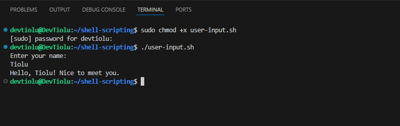
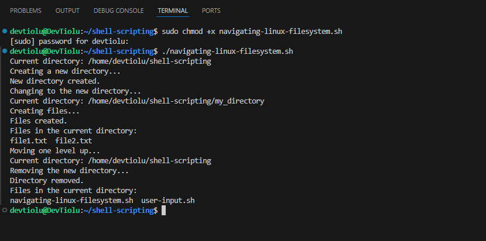
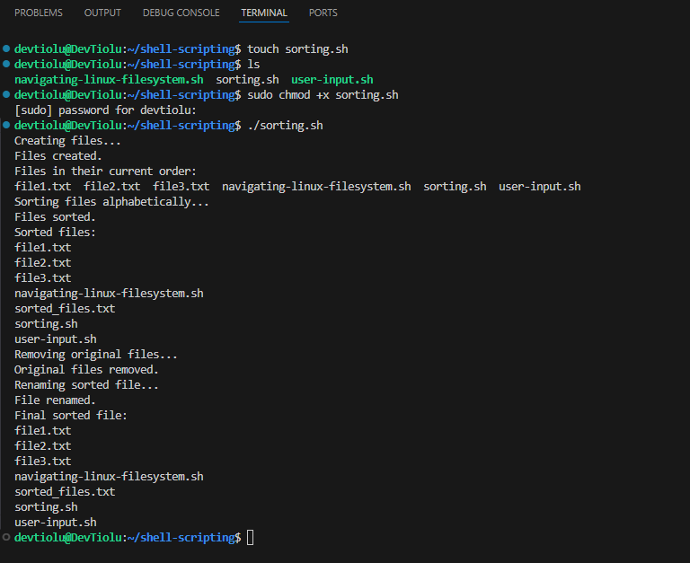
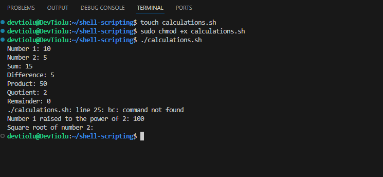
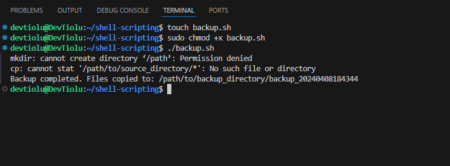

# Shell Scripting

## What is Shell Scripting?

**Shell scripting** is a form of programming or scripting that involves writing a series of commands for a **command-line interpreter**, or **shell**, to execute. A **shell** is a user interface that allows users to interact with the operating system by entering commands.

The primary purpose of shell scripting is automation. Users can create scripts to perform repetitive tasks, execute multiple commands in sequence, or automate system administration tasks.

Commonly used shells for scripting include **Bash (Bourne Again SHell)**, **csh (C Shell)**, **ksh (Korn Shell)**, and **PowerShell** (for Windows). The choice of shell depends on the specific requirements of the task, as well as the operating system environment in use.

## Shell Scripting Syntax Elements

+ **Variables** are used to store and manipulate data. They are assigned values using the '=' operator, and the value is accessed using **$variable_name**.

For example; to assign a value, "**John**" to a variable "**name**", run `name="John"`

To retrieve the variable, `echo $name`

+ **Shebang (#!)** at the beginning of a script specifies the path to the shell that should be used to interpret the script. In this case, it indicates that the Bash shell should be used. It is a combination of **sharp (#)** and **exclamation mark (!)** which is also known as **bang**.

`#!/bin/bash`

+ **Comments**: 
Lines beginning with the **'#'** character are comments and are ignored by the shell. Comments are used to add explanations and annotations to the script for human readers.

`#This is a comment`

+ **Command Execution**:
This allows you to capture the output of a command and store it in a variable. The **$(command)** syntax is used for command substitution.

`result=$(command)`

+ **Control Flow**
  + **Conditionals**: 
  Conditional statements allow you to execute different blocks of code based on specified conditions. Square brackets are used for testing conditions.
  ```
  if [ condition ]; then 
   # commands 
   elif [ another_condition ]; then 
   # commands 
   else 
   # commands 
   fi
  ```

  + **Loops**: 
  Loops allow you to repeat a block of code. **for loops** iterate over a list of items, and **while loops** continue executing as long as a specified condition is true.
  ```
  for item in list; do 
  # commands 
  done 

  while [ condition ]; do 
  # commands 
  done
  ```

+ **Command Subsitution**: 
This feature is useful when you want to capture the result of a command and use it as part of another command or in a variable assignment. You can use the **backtick** or the **$() syntax** for command substitution.
  + Using the backtick for command substitution
  ```
  current_date=`date +%Y-%m-%d`
  ```
  + Using the $() syntax for command substitution
  ```
  current_date=$(date +%Y-%m-%d)
  ```

+ **Input and Output**: 
Bash provides various ways to handle input and output. You can use the **read** command to accept user input, and output text to the console using the **echo** command.

To accept user input;
```
echo "Enter your name:"
read name
```
 
To output text to the terminal;
```
echo "Hello World"
```

+ **Functions**: 
Functions allow you to encapsulate a block of code that can be reused. Functions are defined using the **function_name() { ... } syntax**.

```
#!/bin/bash

# Define a function to greet the user
greet() {
    echo "Hello, $1! Nice to meet you."
}

# Call the greet function and pass the name as an argument
greet "John"
```

## Writing my first Shell Script

+ Open a folder called **shell scripting** using the command `mkdir shell-scripting`.

+ Create a file called **user input** using the command `touch user-input.sh`.


+ Paste the following block of code into the file. 
```
#!/bin/bash

# Prompt the user for their name
echo "Enter your name:"
read name

# Display a greeting with the entered name
echo "Hello, $name! Nice to meet you."
```

+ Save the file and run the command `sudo chmod +x user-input.sh`



## Directory Manipulation and Navigation

+ Open a file named **navigating-linux-filesystem.sh**

+ Paste the code block below into the file.

```
#!/bin/bash

# Display current directory
echo "Current directory: $PWD"

# Create a new directory
echo "Creating a new directory..."
mkdir my_directory
echo "New directory created."

# Change to the new directory
echo "Changing to the new directory..."
cd my_directory
echo "Current directory: $PWD"

# Create some files
echo "Creating files..."
touch file1.txt
touch file2.txt
echo "Files created."

# List the files in the current directory
echo "Files in the current directory:"
ls

# Move one level up
echo "Moving one level up..."
cd ..
echo "Current directory: $PWD"

# Remove the new directory and its contents
echo "Removing the new directory..."
rm -rf my_directory
echo "Directory removed."

# List the files in the current directory again
echo "Files in the current directory:"
ls
```

+ Run the command `sudo chmod +x navigating-linux-filesystem.sh` to give execute permission.

+ Run the script using this command `./navigating-linux-filesystem.sh`



## File Operations and Sorting

+ Create a file called **sorting.sh** in the terminal.

`touch sorting.sh`

+ Copy and paste the code block below into the file.

```
#!/bin/bash

# Create three files
echo "Creating files..."
echo "This is file3." > file3.txt
echo "This is file1." > file1.txt
echo "This is file2." > file2.txt
echo "Files created."

# Display the files in their current order
echo "Files in their current order:"
ls

# Sort the files alphabetically
echo "Sorting files alphabetically..."
ls | sort > sorted_files.txt
echo "Files sorted."

# Display the sorted files
echo "Sorted files:"
cat sorted_files.txt

# Remove the original files
echo "Removing original files..."
rm file1.txt file2.txt file3.txt
echo "Original files removed."

# Rename the sorted file to a more descriptive name
echo "Renaming sorted file..."
mv sorted_files.txt sorted_files_sorted_alphabetically.txt
echo "File renamed."

# Display the final sorted file
echo "Final sorted file:"
cat sorted_files_sorted_alphabetically.txt
```

+ Run the command `sudo chmod +x sorting.sh` to give execute permission.

+ Run the script using this command `./sorting.sh`




## Working with Numbers and Calculations

+ Create a file called **calculations.sh** in the terminal.

`touch calculations.sh`

+ Copy and paste the code block below into the file.

```
#!/bin/bash

# Define two variables with numeric values
num1=10
num2=5

# Perform basic arithmetic operations
sum=$((num1 + num2))
difference=$((num1 - num2))
product=$((num1 * num2))
quotient=$((num1 / num2))
remainder=$((num1 % num2))

# Display the results
echo "Number 1: $num1"
echo "Number 2: $num2"
echo "Sum: $sum"
echo "Difference: $difference"
echo "Product: $product"
echo "Quotient: $quotient"
echo "Remainder: $remainder"

# Perform some more complex calculations
power_of_2=$((num1 ** 2))
square_root=$(echo "sqrt($num2)" | bc)

# Display the results
echo "Number 1 raised to the power of 2: $power_of_2"
echo "Square root of number 2: $square_root"
```

+ Run the command `sudo chmod +x calculations.sh` to give execute permission.

+ Run the script using this command `./calculations.sh`



## File Backup and Timestamping

+ Create a file called **backup.sh** in the terminal.

`touch backup.sh`

+ Copy and paste the code block below into the file.

```
#!/bin/bash

# Define the source directory and backup directory
source_dir="/path/to/source_directory"
backup_dir="/path/to/backup_directory"

# Create a timestamp with the current date and time
timestamp=$(date +"%Y%m%d%H%M%S")

# Create a backup directory with the timestamp
backup_dir_with_timestamp="$backup_dir/backup_$timestamp"

# Create the backup directory
mkdir -p "$backup_dir_with_timestamp"

# Copy all files from the source directory to the backup directory
cp -r "$source_dir"/* "$backup_dir_with_timestamp"

# Display a message indicating the backup process is complete
echo "Backup completed. Files copied to: $backup_dir_with_timestamp"
```

+ Run the command `sudo chmod +x backup.sh` to give execute permission.

+ Run the script using this command `./backup.sh`


