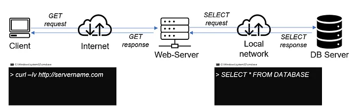

# Understanding Client Server Architecture With MySQL As RDBMS

## Introduction
**Client-Server architecture** is a computing model that divides the functionality of a system into two distinct roles: **clients** and **servers**. In this architecture, **clients** make requests for services or resources, and **servers** provide those services or resources. **MySQL**, as a Relational Database Management System (RDBMS), is often used in a client-server architecture for managing and storing data.



+ **Client**: The client is the end-user device or application that initiates requests to the server. Clients can be various types, such as desktop applications, web browsers, mobile apps, or other devices that need access to data stored in the MySQL database.

+ **Server**: The server hosts the MySQL database and handles client requests. It is responsible for processing queries, managing data, and responding to client requests for information.

+ **MySQL Database**: MySQL is an RDBMS that manages and organizes data in a structured manner. It stores data in tables, enforces relationships between tables, and provides a SQL (Structured Query Language) interface for interacting with the data.

## Implementing a Client Server Architecture Using MySQL

+ Launch 2 Linux based EC2 Instances on **AWS** and name them, **mysql server** and **mysql client**.

+ Connect to both instances from your local computer.


+ Update and upgrade the package lists and apt repositories on both mysql server and mysql client.
```
sudo apt update -y

sudo apt upgrade -y
```

+ Install MySQL server software
```
sudo apt install mysql-server 

mysql --version

sudo systemctl start mysql

sudo systemctl status mysql
```


+ Install MySQL client sofware

```
sudo apt install mysql-client -y
```


+ Allow access to MySQL server for MySQl client
Both EC2 virtual servers are located in the same local virtual network, so they can communicate to each other using local IP addresses. Use mysql server's local IP address to connect from mysql client. MySQL server uses TCP port 3306 by default, so you will have to open it by creating a new entry in ‘Inbound rules’ in ‘mysql server’ Security Groups. For extra security, do not allow all IP addresses to reach your ‘mysql server’ – allow access only to the specific local IP address of your ‘mysql client’.


+ Create a new user and database on MySQL server 
```
sudo mysql

mysql>  CREATE USER 'example_user'@'%' IDENTIFIED WITH mysql_native_password BY 'Password';
```

> [!NOTE]
> The password field should be replaced wih your password

+ Create a database
```
mysql> CREATE DATABASE example_database;
```

+ Grant MySQL client administrative prilvledges
```
mysql> GRANT ALL ON example_database.* TO 'example_user';
```

+ Exit MySQL and restart the mySQL service

```
mysql> exit
```

```
sudo systemctl restart mysql
```


+ Configure MySQL server to allow connections from remote hosts
```
sudo vi /etc/mysql/mysql.conf.d/mysqld.cnf
```


> [!IMPORTANT]
> In the mysqlserver configuration file, change the bind address from 127.0.0.1’ to ‘0.0.0.0, then save and close the file.


+ Connect to MySQL server from MySQL client
```
mysql -u example_user -h <mysql_server_ privateipaddress> -p password
```

+ Check that you have successfully connected to a remote MySQL server and can perform SQL queries
```
show databases;
```