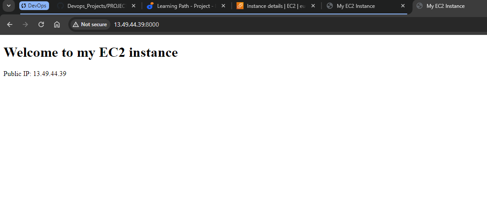

# Implememting Load Balancers With Nginx
## Introduction

**What is Load Balancer?**

A **load balancer** is a network device or software application that efficiently distributes incoming network traffic across multiple servers. The primary purpose of a load balancer is to enhance the availability and reliability of applications by ensuring that no single server is overwhelmed with too much traffic, thus distributing the load across multiple servers.


## Setting up a Basic Load Balancer

### Provisioning EC2 Instance

+ Launch 2 **EC2** instances and name them **"webserver_1"** and **"webserver_2"**.

+ Launch another **EC2** instance and name it **"load balancer"**.

+ Under security, click on security groups and edit inbound rules. Open port 8000 for both webservers and port 80 for the load balancer. Allow traffic from anywhere on the open ports.

+ Connect 2 terminals to webserver_1 and webserver_2

### Installing Apache on both webservers 

+ Install apache

`sudo apt update -y &&  sudo apt install apache2 -y`


+ Verify that Apache has been successfully installed

`sudo systemctl status apache2`


### Configure Apache to a server showing its Public IP

+ Open the file using a text editor

`sudo vi /etc/apache2/ports.conf`

+ Add a new listen directive for port 8000


+ Open the file /etc/apache2/sites-available/000-default.conf and change port 80 on the virtualhost to 8000

`sudo vi /etc/apache2/sites-available/000-default.conf`


+ Restart apache to load the new configuration

`sudo systemctl restart apache2`


+ Open a new index.html file

`sudo vi index.html`

+ Switch vi editor to insert mode and paste the following html file. Use the public IP of your EC2 instance.
```

        <!DOCTYPE html>
        <html>
        <head>
            <title>My EC2 Instance</title>
        </head>
        <body>
            <h1>Welcome to my EC2 instance</h1>
            <p>Public IP: YOUR_PUBLIC_IP</p>
        </body>
        </html>
```


+ Change file ownership of index.html file

`sudo chown www-data:www-data ./index.html`

+ Override the default html file of Apache Webserver

`sudo cp -f ./index.html /var/www/html/index.html`

+ Restart the webservers to load the new configuration

`sudo systemctl restart apache2`


### Install and Configure Nginx as a Load Balancer for the WebServers

+ Update package lists and install nginx

`sudo apt update -y && sudo apt install nginx -y`


+ Verify that Nginx is successfully installed

`sudo systemctl status nginx`


+ Open Nginx configuration file

`sudo vi /etc/nginx/conf.d/loadbalancer.conf`

+ Paste the configuration file below to configure nginx to act like a load balancer.  

Ensure you edit the file and provide necessary information like your server IP address etc.

```
        
        upstream backend_servers {

            # your are to replace the public IP and Port to that of your webservers
            server 127.0.0.1:8000; # public IP and port for webserser 1
            server 127.0.0.1:8000; # public IP and port for webserver 2

        }

        server {
            listen 80;
            server_name <your load balancer's public IP addres>; # provide your load balancers public IP address

            location / {
                proxy_pass http://backend_servers;
                proxy_set_header Host $host;
                proxy_set_header X-Real-IP $remote_addr;
                proxy_set_header X-Forwarded-For $proxy_add_x_forwarded_for;
            }
        }
    
```


+ Test if nginx configuration is correct

`sudo nginx -t`


+ Restart nginx

`sudo systemctl restart nginx`

+ Paste load balancer public Ip address on your web browser to see the content of web server 1 and 2


