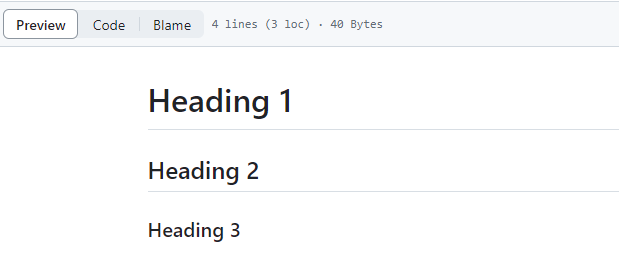

# What is Git?

Git is an open-source software for tracking changes in a distributed version control system. Open-source projects are built and maintained by different developers in different locations.

Git tracks the changes you make to the code and saves them as different versions of your project. This means you can access previous versions of your code. You can also access your code files from another computer.

Git solves the problem of sharing source code efficiently and keeping track of changes made to the source code.

## Initializing a Git Repository

To initialize a git repo, you need to first [install git](https://git-scm.com/downloads) on your computer.

+ Open a terminal on your computer

+ Create a directory using `mkdir DevOps` 

+ Move into the directory using `cd DevOps`

+ While in the folder, run `git init`


## Git Commit

Git commit is a way to save changes made to your files. When you commit, git saves a copy of the current state of your repository in the .git folder inside your working directory.

+ Create a file index.txt using `touch index.txt`

+ Make some changes to the file and save it.

+ Add changes to git staging area using `git add .`

+ Commit your changes using `git commit -m "initial commit"`


## Git Branches

Git branches help you create different copies of your source code.

Branches are used to develop new features, resolve bugs, and to test multiple versions of production code. It also enables remote teams to work on the code from different locations.

+ Use `git checkout -b <new-branch-name>` to create a new branch and change into it.


+ Use `git branch` to list all branches in the repository.


+ Use `git checkout main` to return to the main repository.


+ Merge two branches using `git merge <branch-name>`


+ Delete a branch that is not needed using ` git branch -d <branch_name>`


 > [!NOTE]
> To learn more about git, type `git branch --help` on your command line.


## Github 

Github is a web-based platform where repositories are hosted. It allows remote teams to view and make changes to the same repositories.

Add a remote repository to the local repository using the following command `git remote add origin <link to your github repo>`


Git clone allows us make a copy of a remote repository on our local machine. 

A remote repo can be cloned using `git clone <link to your remote repository>`


## Markdown Syntax

Markdown Syntax is a light markup language used for formatting plain text.

+ Headings : To create headings, use the hash symbol with the number of hashes indicating the level of the heading.

```
# Heading 1
## Heading 2
### Heading 3
```


+ Emphasis : Asterisks or underscores are used to emphasize texts.

```
*italic* or _italic_
**bold** or __bold__
```


+ Lists : ordered and unordered lists

```
- Item 1
- Item 2
- Item 3
```

```
1. First item
2. Second item
3. Third item
```


+ Hyperlinks : To create a hyperlink, put text in square brackets followed by the url in parenthesis. 

`[visit darey.io](https://www.darey.io)`


+ Images : To display an image, use an exclamation mark, followed by square brackets for the text and parenthesis containing the image url.

``


+ Code : Use backticks to display code. 

`console.log('Welcome to darey.io')`


